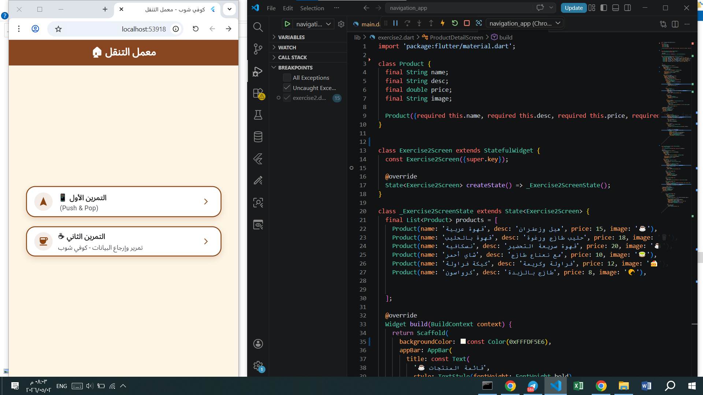
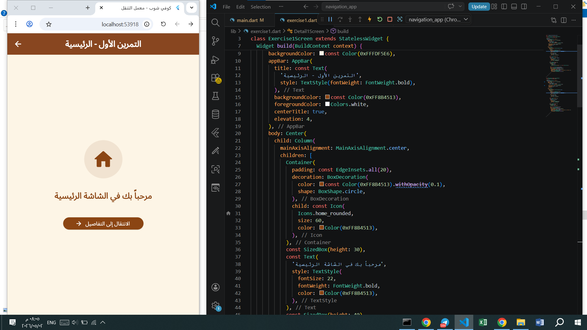
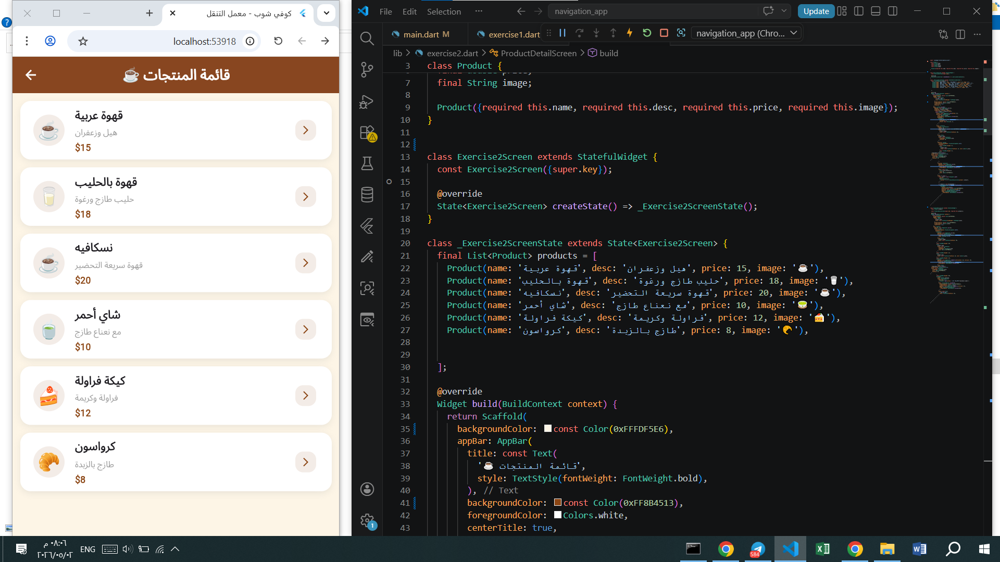
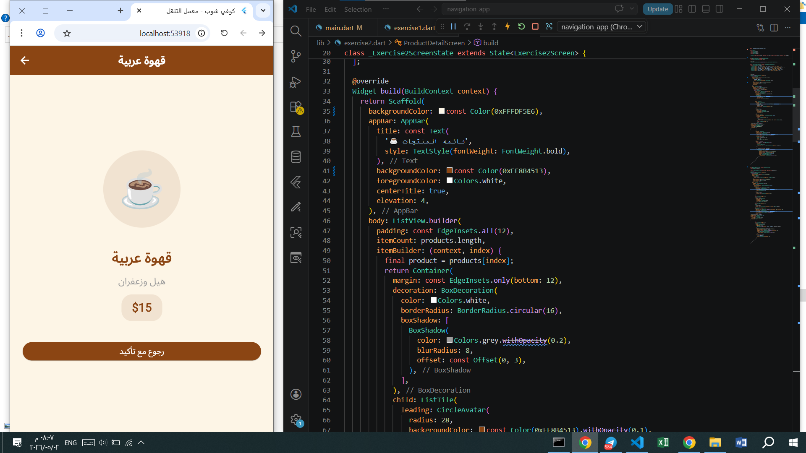
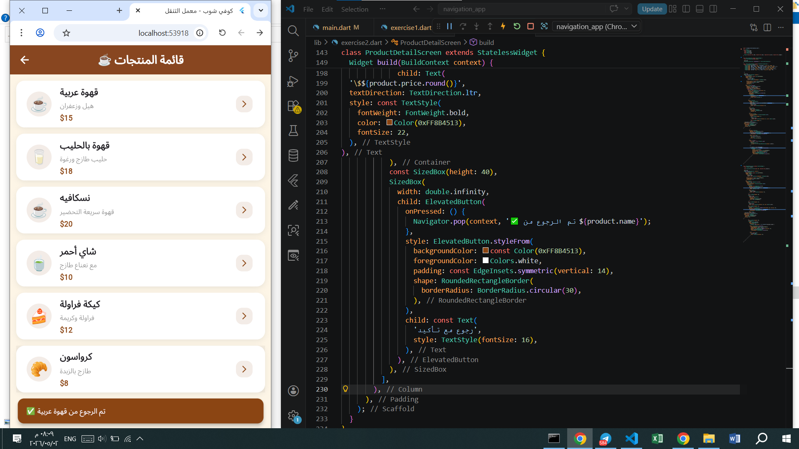

# Lecture 5 - Navigation Assignment

## الاسم:
Raya Alqahtani

## القسم:
اكتبي قسمك هنا

## وصف المشروع:
تطبيق Flutter يوضح التنقل بين الصفحات باستخدام Navigation.

---

## لقطات الشاشة

### القائمة الرئيسية

---

### الصفحة الرئيسية

---

### صفحة التفاصيل

---

### لقطات إضافية

